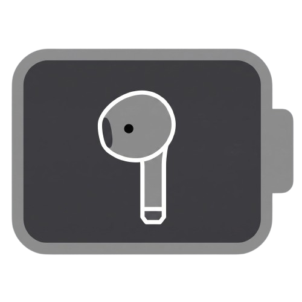

<div align="center">
  
  <h1>AirBattery for Windows</h1>
  <p>A lightweight and clean System Tray application to natively monitor your AirPods' battery on Windows.</p>
</div>

---

## 🌟 Features

- 🔋 **Real-time BLE Monitoring:** Displays your AirPods' battery by passively detecting Apple's Bluetooth Low Energy beacons in the background.
- 🖥️ **Native Integration:** Sits minimally in the Windows System Tray. The icon updates dynamically based on connection status.
- 🚀 **Auto-Start:** Configure it from within the app or during installation to launch silently when your PC boots.
- 📦 **Professional Installer:** Packaged in a standalone, multi-language (English, Spanish, and Portuguese) `.exe` installer.

## 📥 Download & Installation (For Users)

If you just want to use the application, you don't need to touch any code:

1. Go to the **[Releases](../../releases)** section of this repository.
2. Download the latest file named **`AirBattery_1.0.exe`**.
3. Double-click the installer and follow the on-screen steps. *(If Windows SmartScreen warns you about an unrecognized app, click "More info" > "Run anyway").*

## 💻 Development (For Developers)

If you want to modify the code or build the project yourself, you will need Python 3.10+ and a Windows 10/11 system with BLE-compatible Bluetooth.

### 1. Local Setup and Execution
```bash
# Clone the repository
git clone https://github.com/your-username/AirBattery.git
cd AirBattery

# Install dependencies
pip install -r requirements.txt

# Run the application
python airpods_tray.py
```

### 2. Build the Installer
To generate the final executable, this project uses **PyInstaller** to package the code and **Inno Setup** to create the installation wizard:

1. Create the base binary with PyInstaller:
   ```bash
   pyinstaller --onefile --windowed --icon "assets/icon.png" --name "AirBattery" --hidden-import "PIL._tkinter_finder" airpods_tray.py
   ```
2. Compile the attached `setup.iss` file using [Inno Setup 6](https://jrsoftware.org/isinfo.php).

## 📝 Technical Notes
* **10% Precision Limitation:** Due to how Apple designs its Proximity Pairing beacons (0x07) and to avoid interrupting the audio connection, this application reads data passively. Therefore, battery percentages are reported in 10% increments. This is a physical hardware limitation of the AirPods' BLE standard, not a software bug.
* The project has been specifically optimized and tested with the **AirPods 3** model.

---
